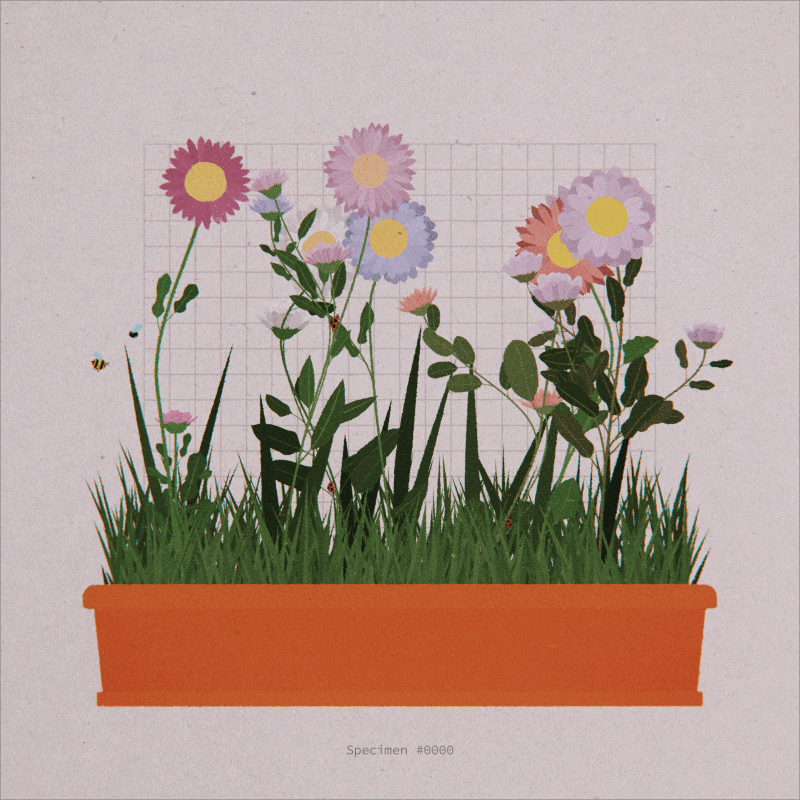

## Overview

This study explores how Perlin noise can be used to drive the motion of thousands of particles in a field. The resulting motion creates flow-field-like visuals.

## Technical Notes

- **Framework:** p5.js
- **Technique:** Noise-driven velocity updates
- **Iterations:** 3 main experiments with different noise scales

## Results

The flow effect emerges when particles accumulate motion over many frames.
